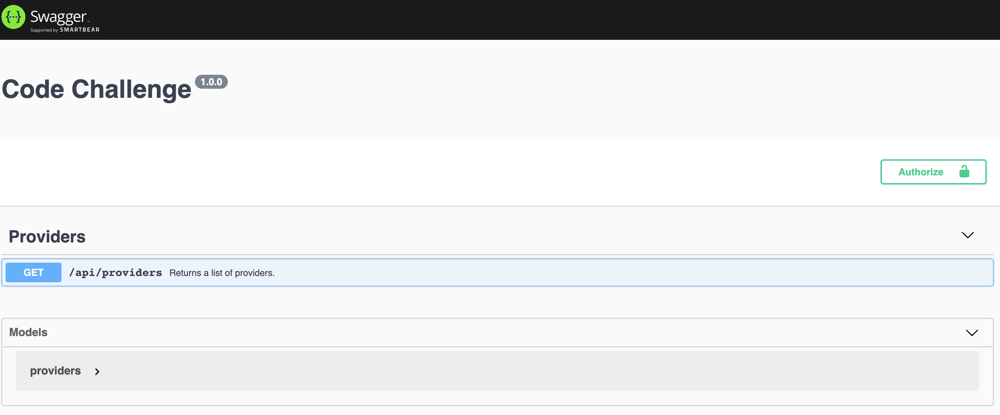
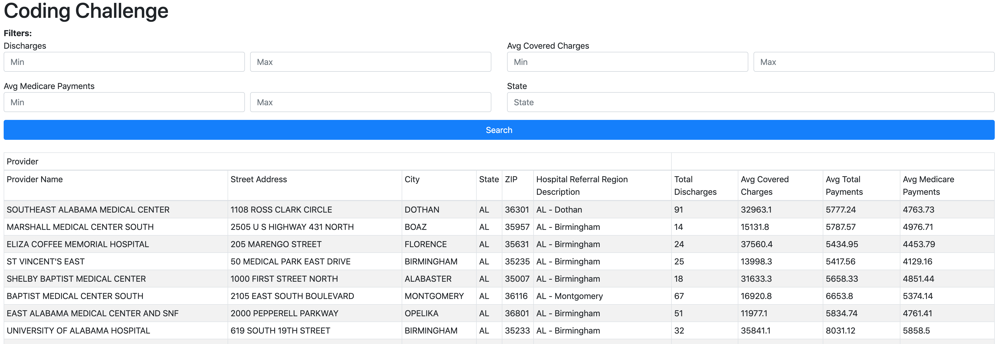

# Coding Challenge

Build a client/server solution to query providers from a given dataset.

## Server

The server is built with NodeJS & Express. In addition its using AWS libraries to run the API on lambda, makes it easier to deploy and host.

### How to run it

Make sure you are on the `server` folder.

1. Install dependencies

    ```sh
    yarn install
    ```
    
2. Configure environment variables

    Create a .env file to set up the db configuration. Your file needs to have a configuration similar to the following:
    ```sh
    DB_DIALECT=mysql
    DB_HOST=somemysqldb.rds.amazonaws.com
    DB_NAME=dbname
    DB_USERNAME=userhere
    DB_PASSWORD=passwordhere
    ``` 

3. Run server

    ```sh
    yarn server
    ```
    
If all goes well you should see:

```sh
listening on port 3001
```

### API Documentation
Once we are running our solution we can access our endpoints and the documentation. To see the api documentation please access the following link with your browser:

```sh
http://localhost:3001/docs
```

You should now see a screen like the following:



## Front-End

The frontend is built using react with typescript.

### How to run 

Make sure you are on the `client` folder.

1. Install dependencies

    ```sh
    yarn install
    ```
    
2. Configure environment variables

    Create a .env file to set up the api configuration. Your file needs to have a configuration similar to the following:
    ```sh
    REACT_APP_API_HOST=http://localhost:3001
    REACT_APP_API_NS=api
    ``` 

3. Run server

    ```sh
    yarn server
    ```
    
If all goes well you should see:

```sh
Compiled successfully!

You can now view client in the browser.

  Local:            http://localhost:3000/
  On Your Network:  http://x.x.x.x:3000/

Note that the development build is not optimized.
To create a production build, use yarn build.

```

NOTE: the frontend will fail to load if the API is not running. If all goes well you should see a screen like the following:



## Deployment

### Server to AWS Lambda

In order to deploy the server to AWS Lambda we are using [SAM](https://docs.aws.amazon.com/serverless-application-model/latest/developerguide/serverless-sam-reference.html).

Here are the steps that needs to be executed (this explanation requires you to have SAM and your AWS profile configured on your system):

1. Build

    ```sh
    sam build
    ```

2. Package the app

    This process will generate a zip file with our code and upload it to S3. You will need to create the s3 bucket before running the command.

    ```sh
    sam package --template-file template.yaml --s3-bucket jc-svc-code-challenge-api --output-template-file packaged.yaml
    ```

3. Deploy

    This step will set all the infrastructure Lambda/API Gateway that is necessary for the code to run. It will also deploy the lambda function.

    ```sh
    sam deploy --template-file ./packaged.yaml --stack-name svc-code-challenge-api --capabilities CAPABILITY_IAM
    ```
    
    You can check what the command did by accessing AWS Cloudformation Website (e.g.: https://console.aws.amazon.com/cloudformation/home?region=us-east-1#/stacks?filter=active)
    
    If everything is good, go to API Gateway, find your the new item `svc-code-challenge-api` and check the URL assigned by AWS.
    
4. Visit lambda and add your environmental variables, same as with `.env` for local. Here is an example

    ```sh
    DB_DIALECT=mysql
    DB_HOST=somemysqldb.rds.amazonaws.com
    DB_NAME=dbname
    DB_USERNAME=userhere
    DB_PASSWORD=passwordhere
    ``` 
    
5. AWS SAM permission fix (optional)

    You may need to fix your execution role into AWS Gateway for both resources `ANY`. Just configure the execution role created by SAM into IAM. This step is not always required but sometimes SAM is not updating the field causing the API to fail.

6. It works! Note: the API docs cannot be run on the server and are only accessible through local machine or with custom deployment.